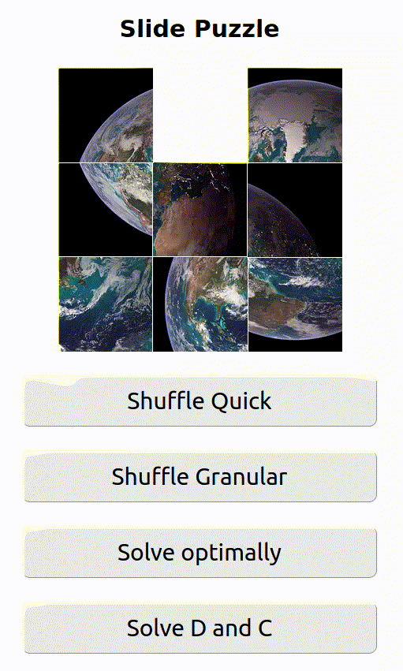

# Slide Puzzle

Implementation of a slide-puzzle game with random puzzles and two solver
algorithms. Written in Rust for [Wasm][wasm].



## Overview

Slide puzzles are square arrays of fields who's surface together represent a
picture or a pattern. One field is missing (the empty field). Horizontal and
vertical neighbours of this missing field can be swapped with it. With this
mechanism, we can rearrange the slide puzzle.

Because we can only swap fields which are (non-diagonal) neighbours of the empty
field, not all permutations of the field array can be solved to the order which
shows the picture. Thus if we want to generate a solvable puzzle, the best way
to do this is by randomly doing valid swaps.

## Modeling

To know which fields can be swapped with which other fields, we need to transform
the indices of the fields to the coordinates in the square puzzle grid and vice
versa to perform swaps.

## Solver Algorithms

There are two algorithms implemented. The optimal one is well suited for smaller
problems but fails to converge for very large puzzles or puzzles with many
steps. The other algorithm is based on the divide&conquer principle, does not
yield optimal solve orders but converges for any reasonable problem size.

### Optimal algorithm

For the optimal solve order, we ask what is the shortest sequence of swaps that
will bring a current state to the final ordered puzzle state. Our puzzle state
is defined by the array of fields. Thus our state space is the space of all
those permutations of the array which can be reached with swaps.

Because at some point one permutation may lead back to another permutation, this
state space is not infinite but can be very large (trivial to see for 1x2 or
also 2x2 puzzles). Finding the optimal solve order means finding the shortest
path between the current state and the final state through the state spaces.

Thus in its most basic form, our optimal algorithm is a breadth-first-search
through the graph of states which builds the graph on the go.

We can see that holding all the states in memory will be the main limiting
factor for our algorithm. To cut down memory requirements as much as possible,
we use `u8` values. With `u8::MAX` (255), we are
limited to puzzles of size `floor(sqrt(255)) == 15` which is enough for our
purposes. It is indispensable to recognize states which we have already seen
before. To do this, we build a set of state hashes.

#### Complexity

For each state on the way from our initial state to the final state, we have to
explore all unseen neighbours. Thus with every step, the amount of space
required grows by the factor of unseen neighbours. We have an algorithm that
grows _exponentially_ in the number of steps. Thus our space complexity is
`O(C^n)`.

What is the factor `C`? Let's take a look at a 3x3 puzzle. If we are trying to
find a shortest path, we should never be undoing the immediately last move.
Thus this are the number of possible moves:

```conf
# Number of possible moves from each field, excluding undoing the last move
1 2 1
2 3 2
1 2 1
```

On average, we have `15 / 9 = 1.667` possible moves. On course, it is not clear
if the moves are uniformly distributed over the field. The implementation of the
algorithm actually prints the number of moves from the path and the number of
iterations taken to find it. We can calculate a proxy for `C` from this. Below
are some example numbers:

```conf
# 20 moves in path, 86059 iterations
86059 ^ (1 / 20) = 1.765

# 20 moves in path, 88793 iterations
88793 ^ (1 / 20) = 1.768

# 18 moves in path, 26549 iterations
26549 ^ (1 / 18) = 1.761
```

So we were not that far off with our guess. Note that for larger puzzles, the
factor is larger which contributes a lot in the exponential function. E.g. for
5x5:

```conf
# Number of possible moves from each field, excluding undoing the last move
1 2 2 2 1
2 3 3 3 2
2 3 3 3 2
2 3 3 3 2
1 2 2 2 1
```

On average, this is `55 / 25 = 2.2`. For a path with length 20, we expect around
`2.2 ^ 20 = 7'054'294` states that have to be evaluated, which can exceed the
memory provided to the process in the browser.

### Divide and conquer algorithm

An alternative algorithm is based on the divide&conquer approach. Instead of
finding the optimal path of moves in the state space, we solve the fringes of
the puzzle first and thereby make the problem ever smaller. Details can be found
[on this website][d_and_c_algorithm_explained].

An illustration of the order in which we solve the fields for a 5x5 puzzle:

```conf
# The number is the order of the group in which the fields are solved/fixed
0 0 0 0 0
1 2 2 2 2
1 3 4 4 4
1 3 5 6 6
1 3 5 6 6
```

While the divide&conquer part seems straight forward, the actual implementation
is quite complicated and tedious:

- The outermost loop alternates between solving rows and columns and enters a
  third special phase when only a 2x2 square is left.
- For the individual fields that we move into a row or column, we need to
  compute a path along which they can move without moving any of the previously
  solved fields.
- Fields cannot move directly but only by moving the empty field to the next
  field on their path and then swapping to this. We use a BFS to find the path
  of the empty field (excluding fixed fields and the field to move itself).

[d_and_c_algorithm_explained]: https://www.kopf.com.br/kaplof/how-to-solve-any-slide-puzzle-regardless-of-its-size/
[wasm]: https://webassembly.org/
